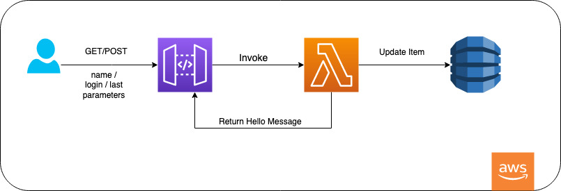
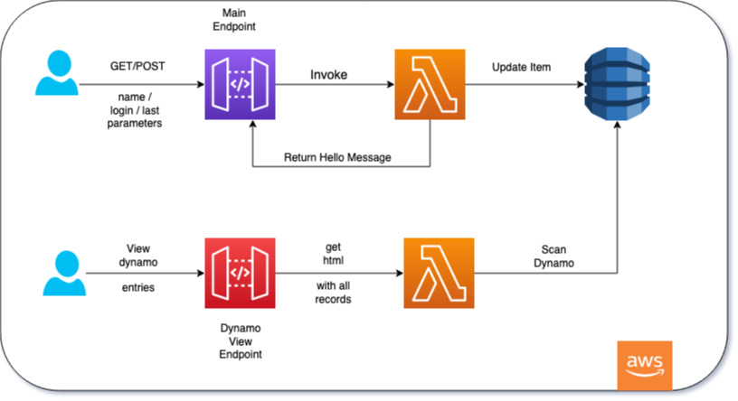

# simple_api

This project demonstrate how to build the infrastructure required for a simple api built using both CDK and terraform it can be used as a refernce on how to create some of the resources.

## Table of contents:
- [Provisioning Infrastructure](#Provisioning-Infrastructure)
- [Architectural Overview](#Architectural-Overview)
- [Testing use cases](#Testing-use-cases)
- [Future Enhancement](#Future-Enhancement)

---
## Provisioning Infrastructure

Please follow steps described at the links below to provision the infrastructure

[CDK](./cdk_api_python/README.md)<br/>
[Terraform](./terraform_api/README.md)


---
## Architectural Overview

This simple api is configured to return a hello message to the end user with the path that was accessed and the time stamp of the request.

The user can submit a case insensetive parameter called "name" or "login" sent either in get query pararmenter or in the body of a post request. In that case the message will be changed to greet him with his login or name and also mention which location the user accessed and the time stamp.

In addition to returning this message to the user, all requests are tracked in a dynamo database table and the api gives the user the ability to query any number of request starting from the most recent request received.


<br/><br/>

---
## Testing use cases

Demo API for testing: https://1i6o5ucg8j.execute-api.eu-west-1.amazonaws.com/prod/ 

Using your browser or any client that can perform POST and GET request you can perform below use cases, for this demo we are using simple curl command.


* Testing GET without any parameters, should return a greeting message

```
% curl -X GET "https://1i6o5ucg8j.execute-api.eu-west-1.amazonaws.com/prod/"             
{"Message": "Hello , You have hit location: / !", "time_stamp": "2021-05-02-04:32:19"}% 
```

* Testing POST  without any parameters, should return a greeting message

```
 % curl -X POST https://1i6o5ucg8j.execute-api.eu-west-1.amazonaws.com/prod/
{"Message": "Hello , You have hit location: / !", "time_stamp": "2021-05-02-04:42:21"}
```

* sending "name" in get query, the parameter is allowed case insensitive so it can be any combination of captial small (e.g Name, NAME, NAme)
```
% curl -X GET "https://1i6o5ucg8j.execute-api.eu-west-1.amazonaws.com/prod/?name=Moataz"
{"Message": "Hello Moataz, You have hit location: / !", "time_stamp": "2021-05-02-04:46:54"}% 
```

* Sending "login" in post body, the parameter is allowed case insensitive so it can be any combination of captial small (e.g Login, LOGIN, LOgin)

```
% curl -X POST -d '{ "Login": "Moataz"}' https://1i6o5ucg8j.execute-api.eu-west-1.amazonaws.com/prod/
{"Message": "Hello Moataz, You have hit location: / !", "time_stamp": "2021-05-02-04:48:12"}% 
```

* Last use case is using the "last" parameter to retreive a json with the last x number of recent requests submitted. Please note that the requests that retreives the last number of requests are not recorded by design.

```
% curl -X GET "https://1i6o5ucg8j.execute-api.eu-west-1.amazonaws.com/prod/?last=2"     
{"last_2_requests": [{"millisec_epoch_time_stamp": 1619930892663, "time_stamp": "2021-05-02-04:48:12", "http_method": "POST", "path": "/", "queryStringParameters": null, "body": "{ \"Login\": \"Moataz\"}"}, {"millisec_epoch_time_stamp": 1619930814190, "time_stamp": "2021-05-02-04:46:54", "http_method": "GET", "path": "/", "queryStringParameters": "{\"name\": \"Moataz\"}", "body": null}]}% 

# or in post data
 % curl -X POST -d '{ "Last": "1"}' https://1i6o5ucg8j.execute-api.eu-west-1.amazonaws.com/prod/
{"last_1_requests": [{"millisec_epoch_time_stamp": 1619930892663, "time_stamp": "2021-05-02-04:48:12", "http_method": "POST", "path": "/", "queryStringParameters": null, "body": "{ \"Login\": \"Moataz\"}"}]}%  
```


---
## Future Enhancement

In the CDK project another api gateway and Lambda were created to view the Dynamo table in a nicely HTML view. Dynamo view URL: https://35vz7686m2.execute-api.eu-west-1.amazonaws.com/prod/

<br/><br/>

* This needs to be implemented to the terraform infrastructure.
* both APIs needs the addition of an authorizer not to allow public access. 


